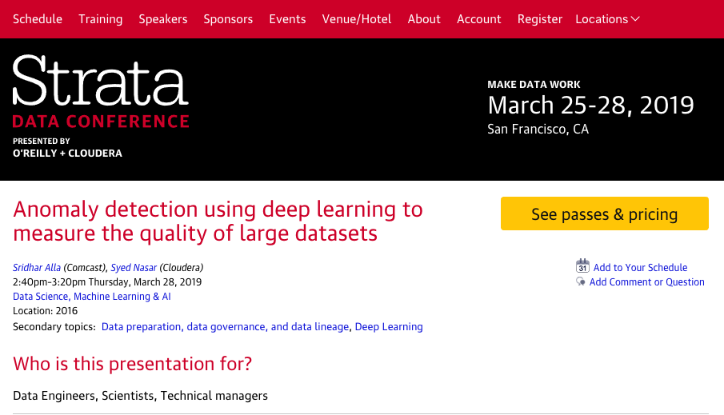

# Anomaly detection using deep learning to measure quality of Large Datasets ​

# Talk Overview: 

> In this talk, we will look at Deep Learning Neural networks and various techniques we can use to detect anomalies in data. In order to derive value from data no matter what kind of ML algorithms and modeling techniques are implemented such as predictive analytics, clustering, bayesian belief networks, regression models, ultimately the effectiveness of the models depends directly on the features used which is again dependent on the input data sources consumed for the purpose. 
To solve this problem, we have implemented modules to define the properties of the data being consumed and detect anomalies in the data, report it and enable the stake holders to discuss and take corrective action.

> In this talk, we will showcase how using Nvidia GPUs , Keras and Tensorflow using Python 3.6, we have pushed the limits on the amount of data that can be profiled and anomalies detected. We also implemented the similar techniques on time-series data particularly using LSTM. Some techniques we cover are deep learning based autoencoders, unsupervised clustering and density based methods.

> We will show some code using [CDSW](https://www.cloudera.com/products/data-science-and-engineering/data-science-workbench.html) notebook to show attendees how they can implement a similar strategy in their organizations.

## Speakers:

* Sridhar Alla (Comcast)
* [Syed Nasar (Cloudera)](https://conferences.oreilly.com/strata/strata-ca-2019/public/schedule/speaker/184705)

## Presented at [Strata Data San Fransisco, 2019](https://conferences.oreilly.com/strata/strata-ca/public/schedule/detail/72656)

### Strata Event:

