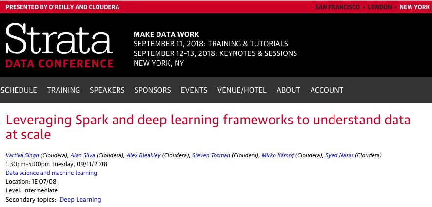

#  Spark and Deep Learning frameworks with distributed workloads

# Talk Overview: 

* Machine Learning and Deep Learning on a scalable infrastructure
* Comparative look - CPU vs CPU+GPU vs GPU
* Challenges with distributing ML pipelines and algorithms
* Frameworks that support distributed scaling
* Spark/YARN on GPUs vs CPUs

## Speakers:

* [Syed Nasar (Cloudera)](https://conferences.oreilly.com/strata/strata-ny-2018/public/schedule/speaker/184705)

## Presented at Strata Data, New York September 2018

### Strata Event

