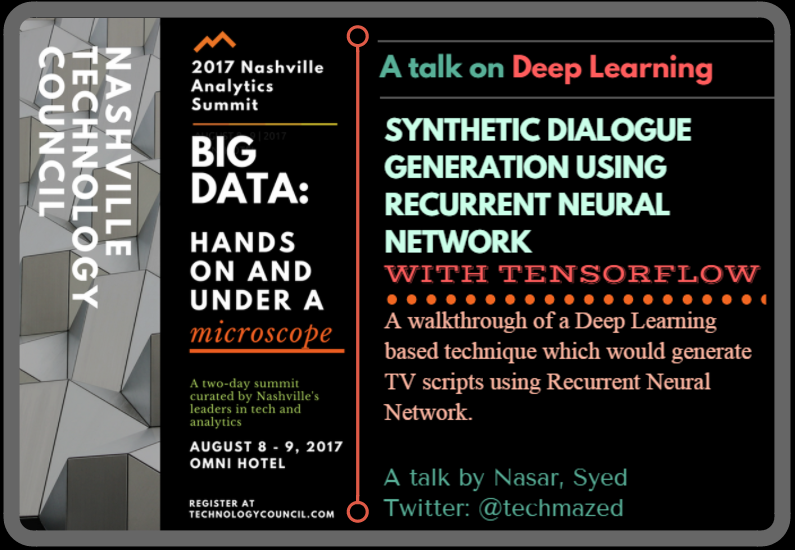

# Synthetic Dialog Generation with Deep Learning using TensorFlow

## Presented at [Nashville Technology Council](http://theanalyticssummit.com/)

# Talk Overview: 
A walkthrough of a Deep Learning based technique which would generate TV scripts using Recurrent Neural Network. The model will generate a completely new TV script for a scene, after being training from a dataset. You will learn the concepts around RNN, NLP and various deep learning techniques.